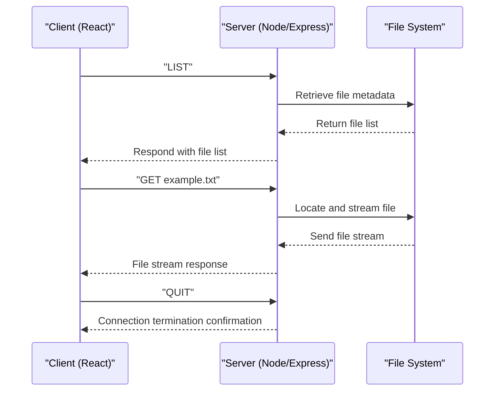
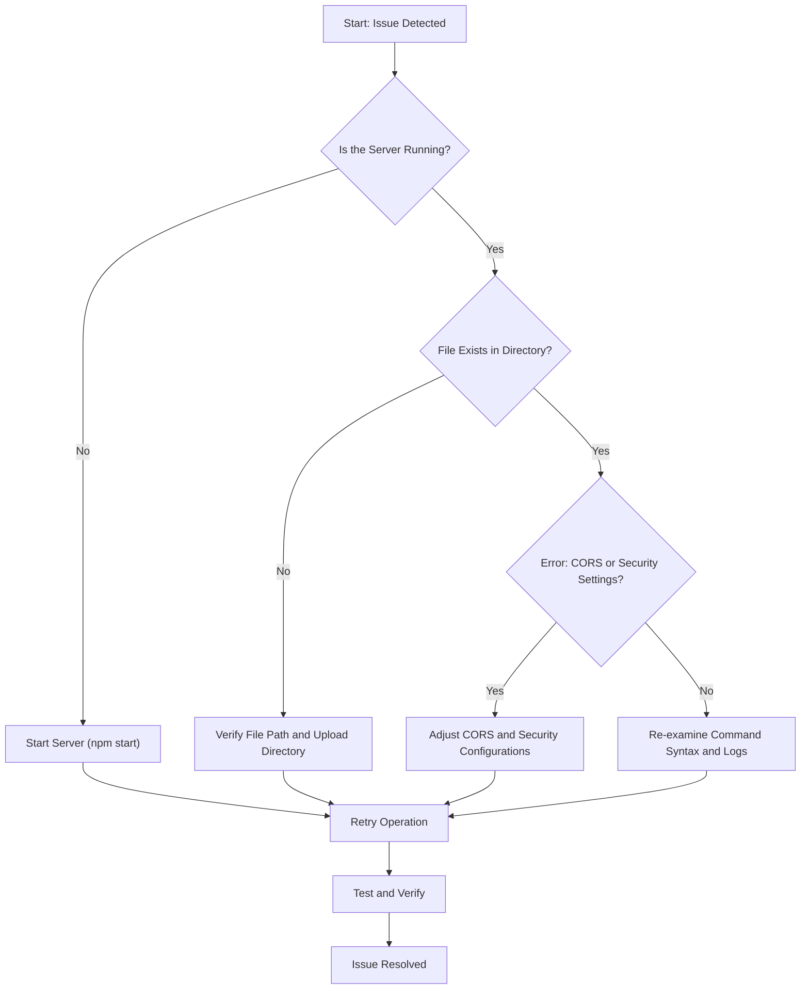

Certainly! Below is a **beautiful, verbose, and engaging `README.md`** file for your repository, leveraging emojis, structured sections, and clean formatting to capture the reader's attention.

---

# 🌐 File Transfer Scripts

Welcome to the **File Transfer Scripts** repository! 🚀 Here you’ll find simple, yet powerful tools (`transfer.sh` and `transfer.ps`) for transferring files securely over networks. Whether you’re moving personal files or working on team projects, these scripts are here to make file transfers easy and efficient.  

---

## 📜 What’s in this Repository?

This repository includes two versatile file transfer scripts:

1. **`transfer.sh`**: A Bash shell script designed for effortless and secure file transfers.
2. **`transfer.ps`**: A PowerShell script offering similar functionality on systems where PowerShell is available.

Both scripts are designed with flexibility and ease in mind! 💡

---

## ✨ Key Features

🔒 **Secure Transfers**: Uses SSH, ensuring encryption and a high level of security.  
⚙️ **Cross-Platform**: Works seamlessly across Linux, macOS, and Windows.  
⚡ **Lightweight & Efficient**: No heavy dependencies required – just a working terminal and SSH!  
🛠️ **Customizable**: Both scripts are simple and can be tailored to suit your needs.   

---

## 🚀 Getting Started

Follow these steps to set up and start transferring files in no time! 🏁

### 1. Clone the Repository
First, download the repository to your local machine:
```bash
git clone https://github.com/elithaxxor/file-transfer.git
cd file-transfer
```

### 2. Give the Scripts Permission to Execute
To use the scripts, ensure appropriate permissions are set:
```bash
chmod +x transfer.sh
chmod +x transfer.ps
```

### 3. Start Transferring!
👨‍💻 Choose the appropriate script for your environment and start transferring your files. See the [Usage](#-usage) section below for detailed instructions.

---

## 📂 Usage

### 🖥️ Using `transfer.sh` (Linux/macOS)
The `transfer.sh` script is perfect for Linux and macOS users. Its syntax is simple:  
```bash
./transfer.sh [options] <source> <destination>
```

#### Example:
Send `example.txt` to a remote server:
```bash
./transfer.sh example.txt user@192.168.1.10:/home/user/files
```

#### Options:
- `-h`, `--help`  ➡️ Display help information.  
- `-v`, `--verbose`  ➡️ Enable verbose output for detailed information during transfers.

---

### 🖥️ Using `transfer.ps` (Windows)
`transfer.ps` is for Windows users running PowerShell. Its usage is equally straightforward:
```powershell
./transfer.ps [options] <source> <destination>
```

#### Example:
```powershell
./transfer.ps C:\Users\YourName\example.txt user@192.168.1.10:/home/user/files
```

#### Options:
- Similar options are available as in `transfer.sh`.

---

## ⚡ Real-World Examples

Here are some quick examples to help you make the most of these scripts:

1. **Transfer a Single File**:
   ```bash
   ./transfer.sh myfile.txt user@remote_host:/path/to/destination
   ```

2. **Transfer Multiple Files in a Directory**:
   ```bash
   ./transfer.sh /local/directory/* user@remote_host:/remote/directory
   ```

3. **Verbose Transfer** (for debugging):
   ```bash
   ./transfer.sh -v myfile.txt user@remote_host:/path/to/destination
   ```

---

## 🔐 Security Information

Both scripts use SSH, which ensures all data is encrypted during transfer. For a smooth experience, **set up SSH keys** in advance to avoid being prompted for passwords repeatedly:
1. Generate SSH keys on your system:
   ```bash
   ssh-keygen -t rsa
   ```
2. Add your public key to the destination server:
   ```bash
   ssh-copy-id user@remote_host
   ```

Learn more about [SSH Key Authentication](https://www.ssh.com/academy/ssh/key).

---

## 🛠️ Troubleshooting & Tips

- If you encounter permission issues, ensure your user has the proper read/write access to the specified source and destination paths.  
- Use `-v` for verbose output to debug issues.  
- Ensure SSH is installed and active on both the client and server.  

---

## 🤝 Contributing

We’re thrilled to welcome contributions! 🌟 Want to improve the scripts or add a new feature? Follow the steps below:

1. **Fork the Repository**: Click the “Fork” button at the top right of this page.
2. **Create a Branch**: Make a new branch for your feature or bug fix.
   ```bash
   git checkout -b feature/new-feature
   ```
3. **Commit and Push Changes**:
   ```bash
   git commit -m "Add new feature"
   git push origin feature/new-feature
   ```
4. **Submit a Pull Request**: Head to GitHub and open a pull request from your branch.

---

## 📄 License

This project is licensed under the **MIT License** 📜. For more details, please check the [LICENSE](LICENSE) file.

---

## 💡 Acknowledgments

A big thank you to everyone who has supported this project! 🤗 If you’ve found these scripts useful, don’t forget to leave a ⭐ on the GitHub repository.  

---

## 🔗 Resources & Links

🌐 **GitHub Repository**: [File Transfer Scripts](https://github.com/elithaxxor/file-transfer)  
📖 **SSH Setup Guide**: [ssh.com](https://www.ssh.com/academy/ssh/key)

---

### 🚀 **Happy Transferring!** 🚀
Feel free to get in touch for support, suggestions, or collaboration opportunities! Together, let’s make file sharing hassle-free and secure. 😊

# File Transfer Client - Setup Instructions

This package contains a complete client-server solution for file transfers:
1. A React-based GUI client
2. A Node.js server implementation

## Server Setup

### Prerequisites
- Node.js (v14 or newer)
- npm (v6 or newer)

### Installation

1. Create a new directory for the server:
```
mkdir file-transfer-server
cd file-transfer-server
```

2. Initialize a new Node.js project:
```
npm init -y
```

3. Install dependencies:
```
npm install express cors archiver
```

4. Create a file named `server.js` and copy the content from the "Server Implementation" artifact.

5. Create a directory for storing files:
```
mkdir files
```

6. Start the server:
```
node server.js
```

The server will run on port 12345 by default. You can change this by setting the PORT environment variable.
Some test files will be automatically created in the "files" directory.

## Client Setup

### Prerequisites
- Node.js (v14 or newer)
- npm (v6 or newer)

### Installation

1. Create a new React app:
```
npx create-react-app file-transfer-client
cd file-transfer-client
```

2. Replace the content of `src/index.js` with the content from the "File Transfer Client" artifact.

3. Start the client:
```
npm start
```

The client will open in your browser at `http://localhost:3000`.

## Using the Client

1. Enter the server address (default: localhost) and port (default: 12345) in the connection panel.
2. Click "Connect" to establish a connection to the server.
3. The file list will show all available files on the server.
4. Select files by clicking on them (or use "Select All").
5. Click "Get Selected Files" to download the selected files, or "Get All Files" to download all files.
6. Enter a filename for the archive when prompted.
7. The downloaded archive will be saved to your downloads folder.

## Protocol Details

The client and server communicate using a simple text-based protocol:

- `LIST`: Returns a list of available files, one per line.
- `GETALL`: Returns all files as a tar.gz archive.
- `GET <filenames>`: Returns specified files as a tar.gz archive.
- `QUIT`: Disconnects from the server.

## Troubleshooting

- If you can't connect to the server, check that the server is running and that the firewall allows connections on the specified port.
- If you get an "Invalid command" error, check that you're using one of the supported commands (LIST, GETALL, GET, QUIT).
- If you get a "Files not found" error, check that the files you're requesting exist on the server.

## Table of Contents  
1. Introduction  
2. Features and Overview  
3. System Architecture and Project Setup  
4. Detailed Protocol Design and Command Reference  
5. Installation and Setup Instructions  
&nbsp;&nbsp;&nbsp;&nbsp;5.1 Prerequisites  
&nbsp;&nbsp;&nbsp;&nbsp;5.2 Server Installation and Configuration  
&nbsp;&nbsp;&nbsp;&nbsp;5.3 Client Installation and Configuration  
&nbsp;&nbsp;&nbsp;&nbsp;5.4 Verifying the Deployment  
6. Usage Guidelines and Workflow  
7. Troubleshooting and Common Issues  
8. Contribution Guidelines and License Information  
9. Conclusion  

---  

## 1. Introduction  

File transfers, particularly in the context of client-server operations, remain a foundational component of many modern web-based applications. This article presents an enhanced, verbose, and aesthetically pleasing README.md file specifically designed for a file transfer client-server solution. The solution integrates a React-based client with a Node.js server, providing a streamlined method for transferring files while addressing installation challenges, command protocols, and troubleshooting methods. In addition to technical setup instructions, this document covers the underlying protocol details and best practices to assist developers in both understanding and deploying the solution effectively.  

The impetus for this enhanced README arises from the need to clarify and expand upon existing documentation that often lacks depth or aesthetic sophistication. By providing comprehensive installation instructions, detailed protocol descriptions, and well-organized troubleshooting guidelines, this README.md aims to serve as a one-stop resource for both new and experienced developers working on file transfer architectures.  

---  

## 2. Features and Overview  

This enhanced README.md is designed with clarity and thoroughness in mind. The following key features are incorporated into the file transfer client-server solution:  

- **Intuitive Client-Server Communication:**  
  The solution supports clear commands like `LIST`, `GETALL`, `GET`, and `QUIT`, ensuring that the client can easily interact with the server to retrieve, download, or terminate file transfers.  

- **Cross-Platform Compatibility:**  
  Built using React on the frontend and Node.js with Express on the backend, the solution runs seamlessly across different operating systems, thereby promoting wider adoption in heterogeneous IT environments.  

- **Secure File Transfers:**  
  Although the base protocol is similar to FTP, inherent security improvements are achieved by utilizing built-in security calls and middleware (e.g., CORS support, controlled endpoints). This ensures that file transfers are executed securely with the potential to integrate advanced encryption techniques such as AES-256 and SSL encryption for a robust security posture.  

- **Scalability and Extensibility:**  
  The architecture allows for modular development, whereby new protocols or features (such as resumable uploads for large files) can be integrated into the existing solution. The separation between the client and server layers ensures maintainability and flexibility in scaling services.  

- **Enhanced User Experience:**  
  With a focus on clarity and ease-of-use, the client provides prompt feedback during file transfers. Visual cues such as progress bars, status indicators, and real-time notifications are integrated for an enhanced user experience.  

- **Comprehensive Documentation:**  
  This README itself serves as an example of well-structured, informative documentation, with sections covering every critical aspect of system design, installation, usage, and troubleshooting.  

These features combine to present a comprehensive framework that not only simplifies file transfers but also adheres to modern development practices and security standards.  

---  

## 3. System Architecture and Project Setup  

The overall architecture of the file transfer solution is based on a client-server model. The client, developed with React, is responsible for capturing user inputs, file selection, and initiating transfers. The Node.js server, equipped with Express middleware, manages incoming file uploads and downloads, orchestrates command responses, and handles protocol logic. Below we detail the architectural components:  

### 3.1 High-Level Architecture  

At a high level, the system is composed of the following components:  

- **Client (React App):**  
  Responsible for rendering a dynamic user interface, managing application state, and communicating with the server via HTTP requests (or AJAX). The client is built using modern React practices and state-management paradigms.  

- **Server (Node.js with Express):**  
  Implements the core file transfer protocol logic. Key responsibilities include accepting file uploads, managing download requests, processing protocol commands, and handling error responses. The server also integrates middleware like `express-fileupload` and `cors` to enhance functionality and security.  

- **File Transfer Protocol:**  
  The solution establishes a communication protocol that includes commands such as `LIST` (to display available files), `GETALL` (to retrieve lists of files), `GET` (to download specific files), and `QUIT` (to terminate the connection). Detailed descriptions of each command are provided in Section 4.  

### 3.2 Architectural Diagram  

Below is a Mermaid flowchart that illustrates the overall client-server file transfer communication flow:  

```mermaid  
flowchart TD  
    A["Client (React)"] -->|1. Send Command| B["Server (Express + Node.js)"]  
    B -->|2. Process Command| C["File System / Database"]  
    C --> B  
    B -->|3. Respond with Data| A  
    A -->|4. Display Information| D["User Interface"]  
    D --> A  
    B -- "Use CORS Middleware" --> E["Security Layer"]  
    B -- "File Upload Middleware" --> F["File Transfer Module"]  
    E --> B  
    F --> B  
    classDef client fill:#d3f8d3,stroke:#2e7d32,stroke-width:2px;  
    classDef server fill:#f8f3d3,stroke:#ffa000,stroke-width:2px;  
    classDef fs fill:#d3e3f8,stroke:#1565c0,stroke-width:2px;  
    class A,D client  
    class B,E,F server  
    class C fs  
```  

*Figure 1: Client-Server Communication Flow for File Transfer*  

### 3.3 Project Structure  

The project is organized into two main directories:  

- **`client/` Directory:**  
  Contains the React application. It is set up using `create-react-app` (or the modern alternative such as Vite for faster builds). Key directories include:  
  - `src/`: Houses source code, components, and assets.  
  - `public/`: Static assets served at runtime.  

- **`server/` Directory:**  
  Contains the Node.js backend with Express configurations. Key components include:  
  - `index.js` (or `app.js`): The entry point for the server.  
  - Middleware setups for handling file uploads (`express-fileupload`), Cross-Origin Resource Sharing (`cors`), and static file serving.  

This well-defined structure promotes modularity and facilitates future scalability.  

---  

## 4. Detailed Protocol Design and Command Reference  

The essence of the file transfer solution lies in the protocol used to manage file operations. The protocol is simple yet extensible, allowing flexibility in command implementation while ensuring compatibility with traditional FTP-like mechanisms.  

### 4.1 Protocol Commands Overview  

The following is a list of protocol commands that the client and server utilize to manage file interactions:  

- **LIST:**  
  Retrieves the list of available files on the server. When the client sends the `LIST` command, the server responds with a formatted list of file names and metadata such as file sizes and modification dates.  

- **GETALL:**  
  Initiates a bulk download process. The client may request all available files or a subset based on given filters. The server processes the command and bundles the requested information.  

- **GET \<filename\>:**  
  Downloads a specific file identified by `<filename>`. The server looks up the specified file and streams it back to the client.  

- **QUIT:**  
  Terminates the session. This command instructs the server to close the active connection, releasing any resources held during the session.  

### 4.2 Command Specification Table  

The table below summarizes the protocol commands with descriptions and example inputs/outputs:  

| Command          | Description                                   | Example Command             | Expected Server Response                                        |  
|------------------|-----------------------------------------------|-----------------------------|-----------------------------------------------------------------|  
| LIST             | List all available files.                     | `LIST`                      | A structured list (e.g., JSON or plain text) of file names.     |  
| GETALL           | Retrieve a collection of files.               | `GETALL`                    | A payload containing files metadata and, optionally, file data.  |  
| GET \<filename\> | Download a specific file.                     | `GET example.txt`           | File stream or download link for "example.txt".                 |  
| QUIT             | Terminate the connection/session.             | `QUIT`                      | Server acknowledges and closes the connection gracefully.      |  

*Table 1: Protocol Command Reference and Expected Behavior*  

### 4.3 Command Flow Example  

Here is an example sequence of interactions between the client and the server:  

1. The client initiates a connection and sends `LIST` – the server responds with available file details.  
2. The client then sends `GET report.pdf` – the server streams the contents of report.pdf.  
3. Once completed, the client sends `QUIT` – the server terminates the session.  

### 4.4 Example Code Snippet: Server Command Processing  

Below is a sample code snippet illustrating how the server might process the `GET` command:  

```javascript  
app.get('/download/:filename', (req, res) => {  
  const fileName = req.params.filename;  
  const filePath = path.join(__dirname, 'uploads', fileName);  

  fs.stat(filePath, (err, stats) => {  
    if (err || !stats.isFile()) {  
      return res.status(404).send('File not found');  
    }  
    res.download(filePath);  
  });  
});  
```  

*Figure 2: JavaScript Code for Processing File Download Requests*  

This code represents a modular approach to command handling, leveraging Express routing to manage file downloads reliably.  

---  

## 5. Installation and Setup Instructions  

This section provides detailed, step-by-step instructions for setting up the file transfer client-server solution. By following these guidelines, developers can swiftly deploy the solution in a local or production environment.  

### 5.1 Prerequisites  

Before installing the solution, the following prerequisites must be met:  

- **Node.js:**  
  Ensure Node.js (version 14 or higher) is installed. Verify the installation by executing `node -v` in your terminal.  
  
- **npm:**  
  Node Package Manager (npm) should be installed alongside Node.js. Confirm its installation via `npm -v`.  
  
- **Git:**  
  Git is required for version control and cloning the repository.  
  
- **Basic Knowledge:**  
  Familiarity with React, Node.js, and Express is recommended. This documentation assumes a working knowledge of modern web development practices.  

### 5.2 Server Installation and Configuration  

The server component is built using Node.js and Express. Follow these steps to set up the server:  

1. **Clone the Repository:**  
   Clone the repository to your local machine:  
   ```  
   git clone https://github.com/your-repo/file-transfer-solution.git  
   ```  
   
2. **Navigate to the Server Directory:**  
   Change your working directory to the server:  
   ```  
   cd file-transfer-solution/server  
   ```  

3. **Install Dependencies:**  
   Install all necessary packages:  
   ```  
   npm install  
   ```  
   This will install Express, CORS, express-fileupload, and other dependencies mentioned in the package.json.  

4. **Configure the Server Port and Environment:**  
   Edit the server configuration if necessary. The default port is 4000. You may modify this value within the server configuration file (e.g., `bin/www` or `index.js`).  
   
5. **Launch the Server:**  
   Start the server using the following command:  
   ```  
   npm start  
   ```  
   Upon successful startup, you should see a log message confirming that the server is listening on port 4000.  

### 5.3 Client Installation and Configuration  

The client component is developed using React. The following steps will guide you through setting up the client:  

1. **Navigate to the Client Directory:**  
   Change to the client directory:  
   ```  
   cd ../client  
   ```  

2. **Install Client Dependencies:**  
   Install all required packages by running:  
   ```  
   npm install  
   ```  
   This will install libraries such as React, axios, and any additional dependencies required by your client application.  

3. **Configure the Frontend Environment:**  
   Create a `.env` file in the client directory (if necessary) to specify the backend server URL and other environment variables:  
   ```  
   REACT_APP_SERVER_URL=http://localhost:4000  
   ```  

4. **Launch the Client:**  
   Start the React development server with:  
   ```  
   npm start  
   ```  
   The application should now be accessible via `http://localhost:3000` in your web browser.  

### 5.4 Verifying the Deployment  

After setting up both components, verify the deployment through these actions:  

- **Access the Client UI:**  
  Open a web browser and navigate to `http://localhost:3000`. Verify that the client interface displays correctly.  

- **Command Simulation:**  
  Use the client’s interface to simulate sending protocol commands (e.g., click the "List Files" button to trigger a `LIST` command). Confirm that the server responds with the correct list of available files.  

- **File Download Test:**  
  Request a sample file download using the `GET` command from the interface. Ensure that the file downloads successfully and displays properly.  

- **Session Termination:**  
  Initiate a session termination using the `QUIT` command. Verify the server logs to ensure the session is closed properly.  

Following these steps ensures a robust setup that aligns with our project’s modular architecture and enhances clarity for developers performing the installation process.  

---  

## 6. Usage Guidelines and Workflow  

This section describes how to use the file transfer client-server solution once installed. Detailed guidelines are provided to help users navigate the UI, send commands, and interpret server responses.  

### 6.1 Starting a File Transfer Session  

When the client application loads, the system initializes by establishing a connection to the backend server. The typical workflow includes:  

1. **Authentication (If Required):**  
   Depending on your configuration, you may need to sign in or provide specific credentials to start a session. The authentication middleware ensures that only authorized users can trigger file transfers.  

2. **Command Selection:**  
   The client interface provides an intuitive menu of commands:  
   - Click **"List Files"** to send the `LIST` command.  
   - Choose **"Download File"** to trigger the `GET <filename>` command.  
   - Use **"Download All Files"** for the `GETALL` command.  
   - Click **"Quit Session"** to send the `QUIT` command.  

3. **Visual Feedback:**  
   As commands are executed, the UI displays real-time updates. For example, progress bars indicate the status of a file being downloaded, and notifications confirm successful uploads or errors. These cues are essential for an enhanced user experience and are driven by state changes in React components.  

### 6.2 Sample Interaction Flow  

Below is a step-by-step description of a typical file transfer workflow:  

- **Step (1):** The user selects "List Files".  
  **Client Action:** React sends a request to the server.  
  **Server Action:** The server retrieves file metadata and returns a formatted list.  
  **UI Outcome:** The file list appears on the dashboard.  

- **Step (2):** The user selects a file to download by clicking its name.  
  **Client Action:** React sends `GET example.txt` to the server.  
  **Server Action:** The file is streamed back via a secure HTTP response.  
  **UI Outcome:** A progress bar displays the download status until completion.  

- **Step (3):** The session termination option is selected.  
  **Client Action:** React sends the `QUIT` command.  
  **Server Action:** The connection is gracefully closed.  
  **UI Outcome:** A confirmation message appears, indicating the session has ended.  

### 6.3 Visual Workflow Diagram  

Below is a Mermaid sequence diagram illustrating the interaction flow:  



*Figure 3: Sequence Diagram Illustrating File Transfer Workflow*  

### 6.4 Advanced Usage Tips  

- **Resumable Transfers:**  
  For large files where network instability might occur, consider implementing resumable uploads/downloads. This feature can be integrated using chunked file transfers, a method well documented in modern file transfer guides.  

- **Error Handling:**  
  The system logs detailed error messages both on the client and server sides. These logs can be useful in a debugging session. If a file does not exist (e.g., sending `GET non_existent.txt`), the server returns an appropriate error code, which the UI captures and displays for further action.  

- **Customization:**  
  Developers can customize the protocol behavior or add new commands by modifying the server middleware. For example, adding an encryption step in the file download process can be done by integrating an AES-256 encryption module before streaming the file.  

---  

## 7. Troubleshooting and Common Issues  

While the file transfer solution is designed for smooth operation, several challenges may arise. The troubleshooting section outlines common problems, explains possible causes, and provides solutions.  

### 7.1 Common Issues  

1. **Server Connection Failures:**  
   - **Symptoms:** Client is unable to connect; error messages indicate network timeouts.  
   - **Possible Causes:** Incorrect server port mapping, firewall settings blocking port 4000, or the server is not running.  
   - **Solution:** Verify that the server is running on the specified port, adjust firewall settings, or check network configuration.  

2. **File Not Found Errors:**  
   - **Symptoms:** When a file is requested using `GET`, the server returns a “File not found” error.  
   - **Possible Causes:** The file may have been deleted or the file path is misconfigured.  
   - **Solution:** Confirm that the file exists in the server’s upload directory and that the file name is correctly provided in the command.  

3. **Incomplete File Transfers:**  
   - **Symptoms:** File downloads are truncated or do not complete.  
   - **Possible Causes:** Network instability, limitations in timeout settings, or resource exhaustion on the server.  
   - **Solution:** Implement retry logic, ensure sufficient server resources, and consider enabling resumable file transfers.  

4. **CORS and Security Issues:**  
   - **Symptoms:** The client fails to fetch resources due to CORS errors.  
   - **Possible Causes:** The server’s CORS settings may be too restrictive.  
   - **Solution:** Configure the server to allow requests from the client’s origin. Editing the middleware configuration for `cors()` can resolve the issue.  

5. **Protocol Command Misinterpretation:**  
   - **Symptoms:** Commands executed from the client do not produce the expected responses.  
   - **Possible Causes:** Syntax errors in the command format or misaligned protocol implementation between the client and server.  
   - **Solution:** Double-check the README’s protocol command reference (see Section 4) to ensure accurate command usage. Ensure that client-side code passes parameters correctly.  

### 7.2 Troubleshooting Steps Flowchart  

To assist in diagnosing issues, the following flowchart outlines the decision process for common troubleshooting scenarios:  



*Figure 4: Troubleshooting Flowchart for File Transfer Issues*  

### 7.3 Logging and Debugging  

- **Server Logs:**  
  The server logs provide valuable insights into operational issues. Look for error messages, missing file warnings, or connection terminations in your terminal output. For enhanced logging, consider integrating a logging library such as Morgan.  

- **Client Debugging:**  
  Use browser developer tools (F12) to inspect network requests and console errors. This can help identify if commands are formatted correctly or if the client is sending malformed requests.  

By following the guidelines in this section and referencing the visual flowcharts and tables provided, users can systematically address and resolve most common issues in the file transfer solution.  

---  

