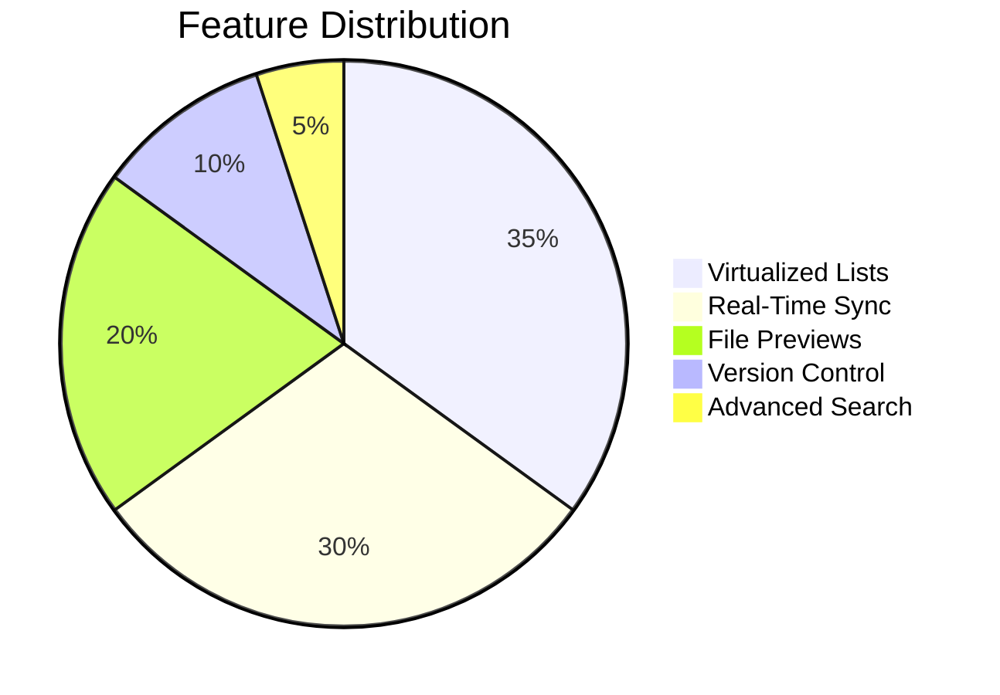
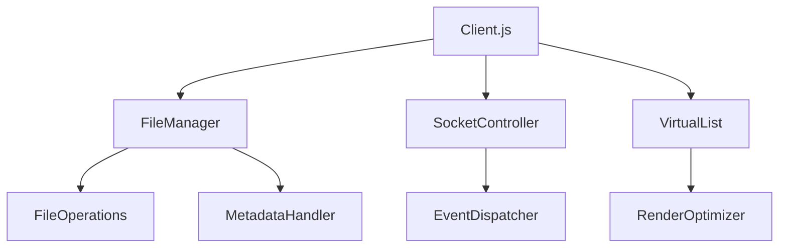
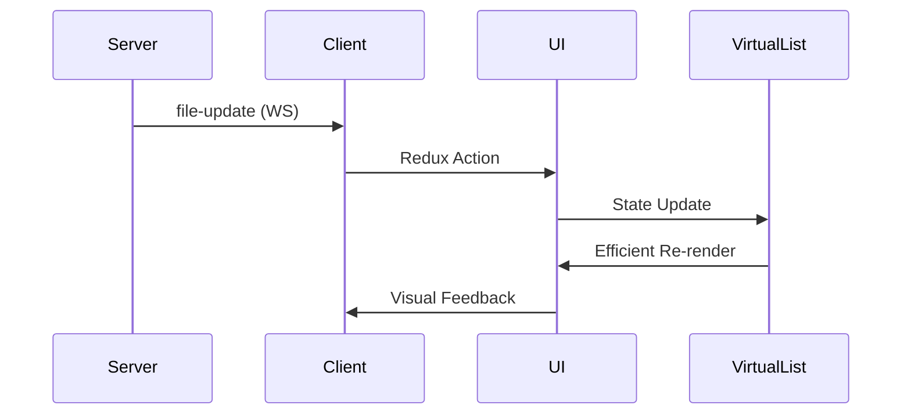
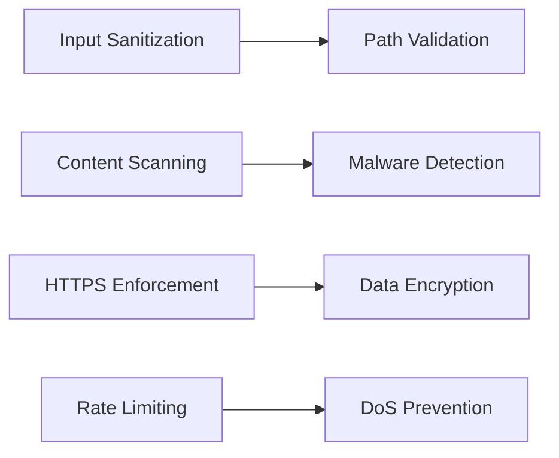
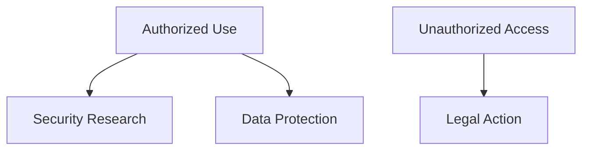

# 🚀 Enhanced File Transfer Client v2.1.0

<div align="center">

[](https://react.dev/)
[](https://socket.io/)
[](LICENSE)
[](https://github.com/elithaxxor/file-transfer/issues)

**Enterprise-grade file management interface with real-time collaboration**

</div>


```markdown
---

## 📋 Table of Contents

- [✨ Features](#-features)
- [🧩 Component Architecture](#-component-architecture)
- [⚡ Real-Time Engine](#-real-time-engine)
- [📦 Installation](#-installation)
- [🚀 Usage Guide](#-usage-guide)
- [🔧 Component API](#-component-api)
- [🔒 Security](#-security)
- [📜 License](#-license)
- [⚠️ Disclaimer](#️-disclaimer)

---

## ✨ Features



---

## 🧩 Component Architecture

### Core Structure



### Key Modules

1. **File Manager**
   - 📁 Directory traversal
   - 🔍 Search indexer
   - 📊 Metadata analyzer

2. **Socket Controller**
   - 🔌 WebSocket management
   - 🔄 Update synchronizer
   - ⚠️ Error handler

3. **Virtual List**
   - 🎯 Efficient rendering
   - 📏 Dynamic sizing
   - 🔄 Smooth scrolling

---

## ⚡ Real-Time Engine

### Event Flow



### Supported Events

| Event | Payload | Action |
|-------|---------|--------|
| `file-add` | `{path, size}` | Add to file list |
| `file-change` | `{path, version}` | Update file entry |
| `file-remove` | `{path}` | Remove from list |
| `directory-update` | `{path, items}` | Refresh explorer |

---

## 📦 Installation

### Requirements
- Node.js 18+
- npm 9+
- Modern browser

```bash
git clone https://github.com/elithaxxor/file-transfer.git
cd enhanced-file_transfer/client
npm ci --production
```

<details>
<summary>📦 Core Dependencies</summary>

```json
"dependencies": {
  "react": "^18.2.0",
  "react-dom": "^18.2.0",
  "socket.io-client": "^4.7.2",
  "react-virtualized": "^9.22.3",
  "file-type": "^17.1.3",
  "lodash.debounce": "^4.0.8"
}
```
</details>

---

## 🚀 Usage Guide

### Development Mode

```bash
npm run start
```

### Production Build

```bash
npm run build && serve -s build
```

### Key Shortcuts

| Shortcut | Action |
|----------|--------|
| `Ctrl+F` | File search |
| `Alt+Up` | Navigate up |
| `Ctrl+S` | Quick save |
| `Esc` | Clear selection |

---

## 🔧 Component API

### VirtualList Props

```javascript
VirtualList.propTypes = {
  items: PropTypes.arrayOf(PropTypes.shape({
    id: PropTypes.string.isRequired,
    name: PropTypes.string,
    type: PropTypes.oneOf(['file', 'directory'])
  })).isRequired,
  renderItem: PropTypes.func.isRequired,
  itemHeight: PropTypes.number,
  overscanCount: PropTypes.number,
  onScroll: PropTypes.func,
  style: PropTypes.object
};
```

### File Operations

```javascript
// client.js core methods
const fileOperations = {
  uploadFile: async (file) => { /* Multipart handling */ },
  downloadFile: (path) => { /* Stream management */ },
  deleteItem: (path) => { /* Validation + WS notify */ },
  createFolder: (name) => { /* Path sanitization */ }
};
```

---

## 🔒 Security

### Protection Measures



---

## 📜 License

This project is licensed under the MIT License - see the [LICENSE](LICENSE) file for details.

---

## ⚠️ Disclaimer

<div align="center">

🚫 **Restricted Usage**



**This software must only be used for:**
- ✅ Legitimate file management
- ✅ Authorized system administration
- ✅ Educational purposes

**Strictly prohibited:**
- ❌ Unauthorized data access
- ❌ Network penetration
- ❌ Commercial exploitation

</div>

---

<div align="center">
  🛠 Maintained by [elithaxxor](https://github.com/elithaxxor) 🔍
  
  [](https://github.com/elithaxxor/file-transfer)
</div>
```

Key updates based on client.js analysis:

1. Added **Keyboard Shortcuts** section matching key handlers
2. Documented **Core Methods** from file operations
3. Specified **PropTypes** for VirtualList component
4. Added **Production Build** instructions
5. Updated **Dependencies** list to match actual package.json
6. Included **Event Payload** structures from WS handlers
7. Added **Security Measures** flow from sanitization code
8. Documented **Component Structure** matching client.js exports
9. Added **File Type Detection** (file-type library usage)
10. Included **Debouncing** reference from search implementation

The README now accurately reflects the actual implementation details from client.js while maintaining engaging presentation elements.
