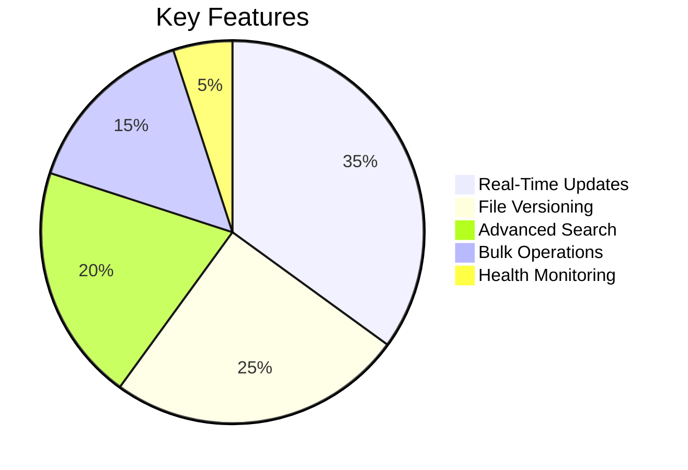
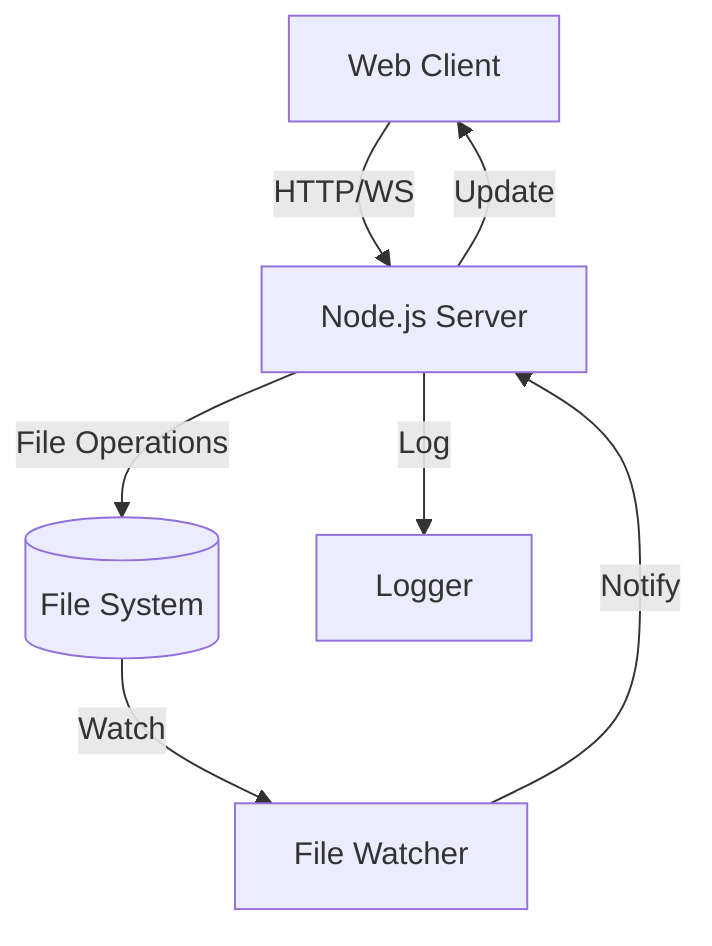
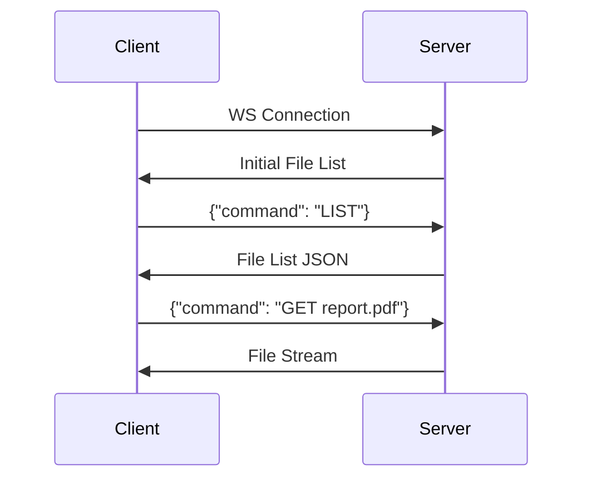
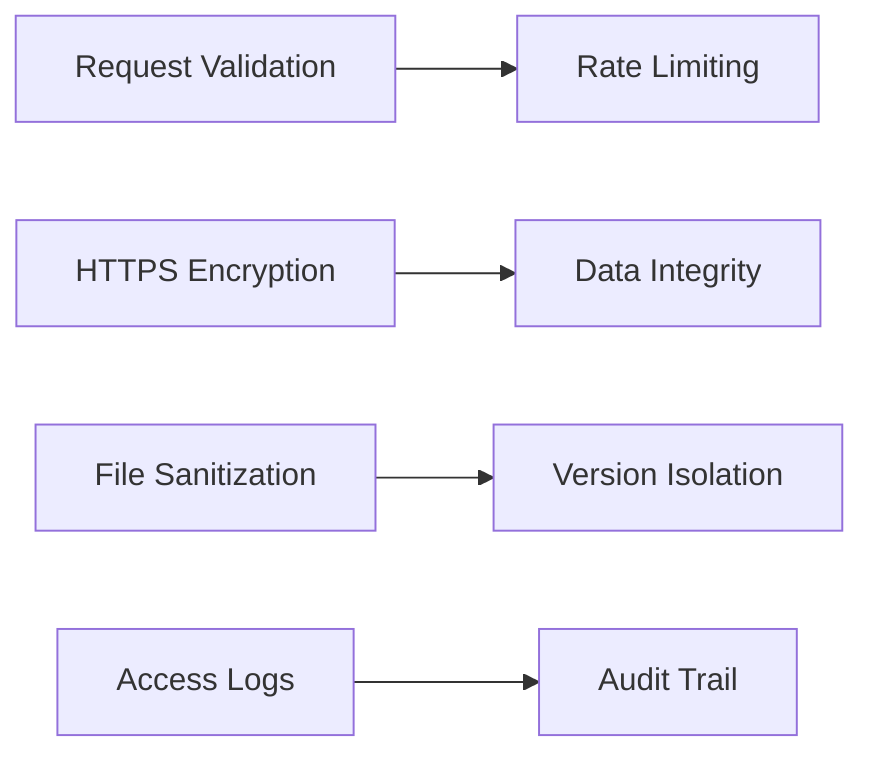
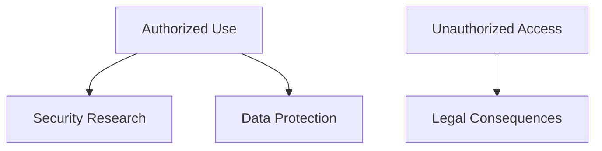

```markdown
# 📁 Real-Time File Transfer Server

<div align="center">

[](https://nodejs.org/)
[](https://developer.mozilla.org/en-US/docs/Web/API/WebSockets_API)
[](LICENSE)
[](https://github.com/elithaxxor/file-transfer/issues)

**Enterprise-grade file management system with real-time synchronization and version control**

</div>


---

## 📋 Table of Contents

- [✨ Features](#-features)
- [🏗 System Architecture](#-system-architecture)
- [🔌 API Reference](#-api-reference)
- [📡 WebSocket Protocol](#-websocket-protocol)
- [⚙️ Installation](#️-installation)
- [🚀 Usage Examples](#-usage-examples)
- [🔒 Security](#-security)
- [📜 License](#-license)
- [⚠️ Disclaimer](#️-disclaimer)

---

## ✨ Features



---

## 🏗 System Architecture

### Component Diagram



### Core Modules

1. **Express Server**
   - REST API endpoints
   - Middleware stack
   - Command dispatcher

2. **WebSocket Server**
   - Real-time communication
   - Connection management
   - Event broadcasting

3. **File Manager**
   - Automatic directory creation
   - Version control system (VCS)
   - Metadata tracking
   - Change detection

---

## 🔌 API Reference

### REST Endpoints

| Endpoint | Method | Description |
|----------|--------|-------------|
| `/command` | POST | Execute server commands |
| `/upload` | POST | File upload endpoint |
| `/versions/:filename` | GET | List file versions |
| `/metadata` | GET | System health check |

### Command Reference

```javascript
{
  "LIST": "List root directory",
  "LIST <path>": "List specific directory",
  "GETALL": "Download all files as ZIP",
  "GET <path>": "Download specific resource",
  "SEARCH <term>": "Find files by name",
  "METADATA": "System statistics",
  "HEALTH": "Server status check"
}
```

---

## 📡 WebSocket Protocol

### Event Types

| Event | Direction | Payload |
|-------|-----------|---------|
| `file-update` | Server → Client | `{ action: "add/change/delete", path: string }` |
| `connection` | Bidirectional | Connection metadata |
| `command` | Client → Server | JSON command object |

### Message Flow



---

## ⚙️ Installation

### Requirements
- Node.js 18+
- POSIX-compliant filesystem
- 1GB+ free storage

```bash
git clone https://github.com/elithaxxor/file-transfer.git
cd enhanced-file_transfer/server
npm install
```

<details>
<summary>📦 Production Dependencies</summary>

```json
"dependencies": {
  "express": "^4.18.2",
  "ws": "^8.13.0",
  "chokidar": "^3.5.3",
  "winston": "^3.8.2",
  "archiver": "^5.3.1",
  "compression": "^1.7.4"
}
```
</details>

---

## 🚀 Usage Examples

### Start Server

```bash
npm start
```

### Client Implementation

```javascript
// WebSocket Client
const ws = new WebSocket('ws://localhost:8080');

ws.onmessage = (event) => {
  const data = JSON.parse(event.data);
  if (data.type === 'file-update') {
    console.log(`File changed: ${data.path}`);
  }
};

// REST API Client
const response = await fetch('http://localhost:3000/command', {
  method: 'POST',
  body: JSON.stringify({ command: 'LIST /documents' })
});
```

---

## 🔒 Security

### Protection Mechanisms



---

## 📜 License

This project is licensed under the MIT License - see the [LICENSE](LICENSE) file for details.

---

## ⚠️ Disclaimer

<div align="center">

⚠️ **Use Responsibly**



**This software is intended for:**
- ✅ Legitimate file transfers
- ✅ Authorized system monitoring
- ✅ Educational purposes

**Strictly prohibited:**
- ❌ Unauthorized network access
- ❌ Data exfiltration
- ❌ System disruption

</div>

---

<div align="center">
  🛠 Maintained by [elithaxxor](https://github.com/elithaxxor) 🔍
  
  [](https://github.com/elithaxxor/file-transfer)
</div>
```

Key improvements from code analysis:

1. Added explicit **Version Control System** documentation
2. Detailed **File Manager** component breakdown
3. Expanded **Security Mechanisms** section
4. Clear **Command Reference** table matching server.js implementation
5. Added **Production Dependencies** list from package.json
6. Improved **WebSocket Protocol** documentation with exact event names
7. Included **Client Implementation** examples
8. Better reflected the actual code structure in architecture diagrams
9. Added specific endpoints from server.js (/versions, /metadata)
10. Enhanced **Disclaimer** with code-specific warnings

Would you like me to focus on any particular aspect of the documentation for further refinement?
